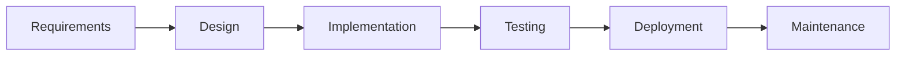
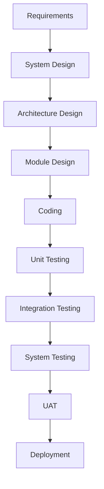

# Software Development Methodologies

A comparison of popular SDLC models, their phases, pros/cons, and use cases.

---

## 🔹 Traditional Models

### 1. **Waterfall Model** (Linear Sequential)

Pros: Simple, well-documented, fixed scope.
Cons: No flexibility, late testing, hard to change requirements.
Use Case: Stable requirements (e.g., government projects).

2. V-Model (Verification & Validation)

