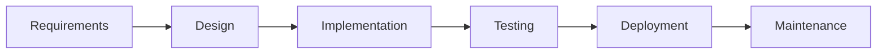
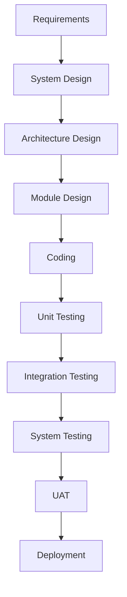
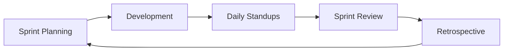
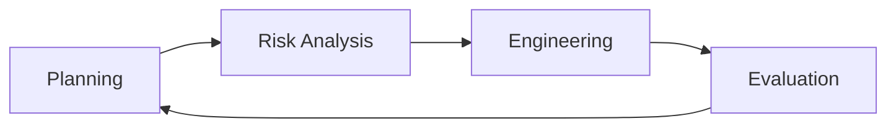
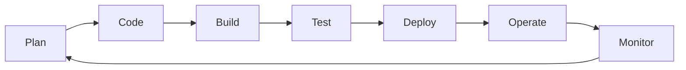
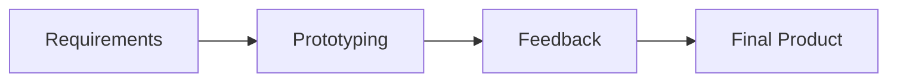

# Software Development Methodologies

A comparison of popular SDLC models, their phases, pros/cons, and use cases.

---

## 🔹 Traditional Models

### 1. **Waterfall Model** (Linear Sequential)

Pros: Simple, well-documented, fixed scope.
Cons: No flexibility, late testing, hard to change requirements.
Use Case: Stable requirements (e.g., government projects).

2. V-Model (Verification & Validation)

Pros: Early testing, high discipline.
Cons: Rigid, costly changes.
Use Case: Critical systems (e.g., medical software).

🔹 Iterative & Incremental Models
3. Agile (Scrum, Kanban)

Pros: Flexible, customer feedback, fast delivery.
Cons: Requires active user involvement, less predictable.
Use Case: Dynamic projects (e.g., startups, SaaS).

4. Spiral Model (Risk-Driven)

Pros: Handles risks, combines Waterfall + Agile.
Cons: Complex, expensive.
Use Case: High-risk projects (e.g., aerospace).

🔹 Hybrid & Modern Models
5. DevOps (CI/CD Pipeline)

Pros: Faster releases, automation.
Cons: Cultural shift needed.
Use Case: Cloud-native apps (e.g., microservices).

6. RAD Model (Rapid Application Development)

Pros: Quick prototypes, user involvement.
Cons: High dependency on skilled teams.
Use Case: UI-heavy apps (e.g., e-commerce).

📊 Comparison Table
Model	   Flexibility	      Testing Phase	     User Feedback	   Risk Management	    Best For
Waterfall	❌Low	              Late	          Minimal	           ❌	            Stable Projects
V-Model	    ❌Low	            Parallel	      Minimal	        ⚠️ Medium	        Critical Systems
Agile	    ✅High	           Continuous	     ✅Frequent	         ✅High	           Dynamic Projects
Spiral	  ⚠️Medium	           Iterative	    ⚠️ Occasional	     ✅ High	       High-Risk Projects
DevOps	   ✅High	           Automated	    ✅ Continuous	     ✅ High	          Cloud/CI-CD
